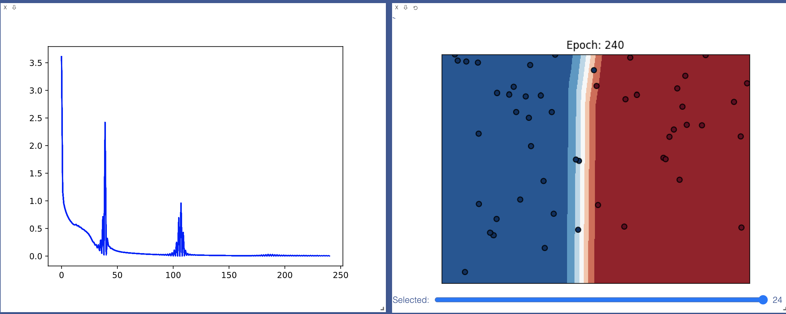
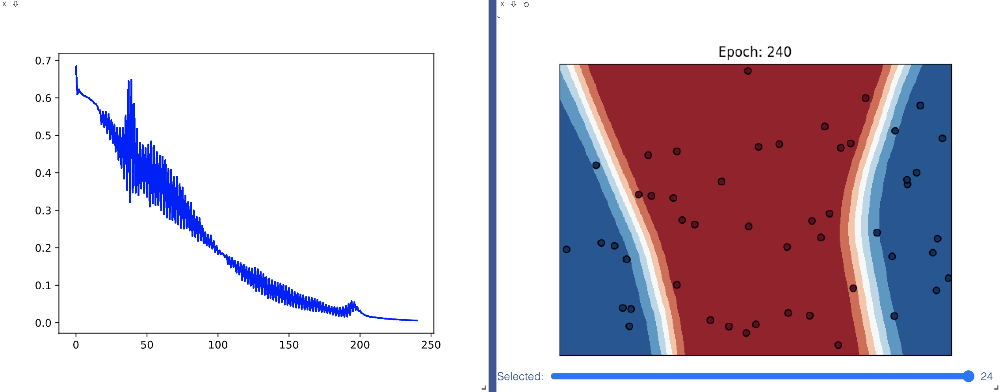
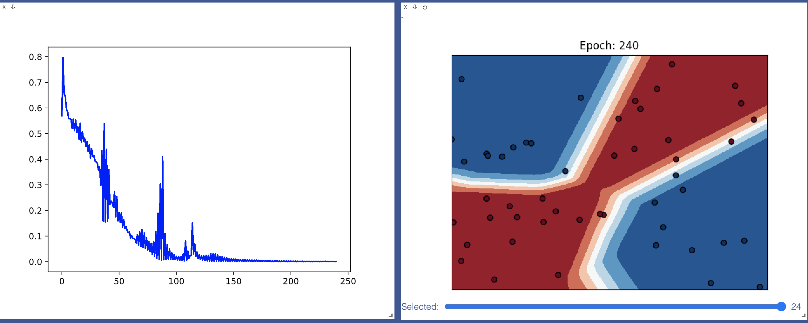

[](https://classroom.github.com/online_ide?assignment_repo_id=3279996&assignment_repo_type=AssignmentRepo)

# MiniTorch Module 2


- Docs: https://minitorch.github.io/

- Overview: https://minitorch.github.io/module2.html

This module requires `operators.py`, `module.py`, `scalar.py`, and `autodiff.py` from previous modules.

- Tests:

```
python run_tests.py
```

## Simple


Epoch 0 loss 3.61261306655342 correct 21 time 1.140566110610962
Epoch 10 loss 0.5870638040969676 correct 33 time 1.0528311729431152
Epoch 20 loss 0.4778253395314089 correct 44 time 1.0651040077209473
Epoch 30 loss 0.20042580388572603 correct 47 time 1.033099889755249
Epoch 40 loss 0.02402442288660483 correct 30 time 1.041388988494873
Epoch 50 loss 0.08979347152432314 correct 49 time 1.3100578784942627
Epoch 60 loss 0.05763095434050084 correct 49 time 1.1194758415222168
Epoch 70 loss 0.042334211344056544 correct 49 time 1.0824320316314697
Epoch 80 loss 0.031247255980506414 correct 49 time 1.1005430221557617
Epoch 90 loss 0.021086760362833107 correct 49 time 1.0225028991699219
Epoch 100 loss 0.005678527386644756 correct 48 time 1.186858892440796
Epoch 110 loss 0.0073654526851020564 correct 46 time 1.1542446613311768
Epoch 120 loss 0.0184635899761759 correct 50 time 1.095890998840332
Epoch 130 loss 0.014361836304787332 correct 50 time 1.1105899810791016
Epoch 140 loss 0.011508761833694644 correct 50 time 1.0986440181732178
Epoch 150 loss 0.00862364758531386 correct 50 time 1.0459849834442139
Epoch 160 loss 0.006679230625003755 correct 50 time 1.019803762435913
Epoch 170 loss 0.004607403069264887 correct 49 time 1.0119938850402832
Epoch 180 loss 0.0023847989185467704 correct 48 time 1.055783987045288
Epoch 190 loss 0.002212051786725907 correct 48 time 1.0504319667816162
Epoch 200 loss 0.0028034093955747424 correct 48 time 1.032620906829834
Epoch 210 loss 0.0027196156673039216 correct 48 time 1.1311261653900146
Epoch 220 loss 0.002435953342702064 correct 48 time 1.1668407917022705
Epoch 230 loss 0.002229877128846728 correct 48 time 1.1195051670074463
Epoch 240 loss 0.0021233394740470036 correct 48 time 1.1137220859527588

## Split


Epoch 0 loss 0.6836840376919615 correct 28 time 1.020555019378662
Epoch 10 loss 0.5953406423411113 correct 31 time 1.219743013381958
Epoch 20 loss 0.5214295630131675 correct 30 time 1.1149959564208984
Epoch 30 loss 0.43436102924332465 correct 30 time 1.0581891536712646
Epoch 40 loss 0.3474218067882929 correct 30 time 1.044191837310791
Epoch 50 loss 0.336137836287056 correct 34 time 1.12050199508667
Epoch 60 loss 0.30009091551633826 correct 36 time 1.0618901252746582
Epoch 70 loss 0.2667885271126888 correct 36 time 1.0253119468688965
Epoch 80 loss 0.24655050938894024 correct 38 time 1.077192783355713
Epoch 90 loss 0.21236472847129903 correct 39 time 1.0494232177734375
Epoch 100 loss 0.1828652184922724 correct 40 time 1.1667766571044922
Epoch 110 loss 0.17250406270159654 correct 40 time 1.1187922954559326
Epoch 120 loss 0.14820904217356304 correct 43 time 1.0060598850250244
Epoch 130 loss 0.1357551485916169 correct 45 time 1.0402891635894775
Epoch 140 loss 0.10910151144947898 correct 45 time 1.0710279941558838
Epoch 150 loss 0.092095578179102 correct 45 time 1.061629056930542
Epoch 160 loss 0.07278793036413325 correct 45 time 1.063952922821045
Epoch 170 loss 0.06092018670680833 correct 45 time 1.0407509803771973
Epoch 180 loss 0.042996671736112616 correct 46 time 1.0848438739776611
Epoch 190 loss 0.04480381500814053 correct 44 time 1.0408298969268799
Epoch 200 loss 0.032632963472043405 correct 50 time 1.0781409740447998
Epoch 210 loss 0.014653727140543575 correct 50 time 1.0198338031768799
Epoch 220 loss 0.01020684244021308 correct 50 time 1.3576951026916504
Epoch 230 loss 0.007712545107340868 correct 50 time 1.0680100917816162
Epoch 240 loss 0.005962415521173208 correct 50 time 1.0555298328399658

## Xor


Epoch 0 loss 0.5698302854881646 correct 14 time 1.1597659587860107
Epoch 10 loss 0.5558080083485732 correct 35 time 1.0949409008026123
Epoch 20 loss 0.4820257310858141 correct 37 time 1.0111539363861084
Epoch 30 loss 0.3894842725047094 correct 46 time 1.0988740921020508
Epoch 40 loss 0.15767696267805006 correct 31 time 1.0453169345855713
Epoch 50 loss 0.19206488580845332 correct 39 time 1.0044701099395752
Epoch 60 loss 0.0926157974677734 correct 39 time 1.0367140769958496
Epoch 70 loss 0.12492352267346153 correct 39 time 1.0060319900512695
Epoch 80 loss 0.07637925746159682 correct 45 time 0.9576780796051025
Epoch 90 loss 0.1103232282896903 correct 44 time 1.0247108936309814
Epoch 100 loss 0.020704460133025897 correct 46 time 1.1048011779785156
Epoch 110 loss 0.04083638233280551 correct 38 time 1.0182640552520752
Epoch 120 loss 0.026528545647423445 correct 46 time 1.050663948059082
Epoch 130 loss 0.03165000342827228 correct 44 time 0.9900417327880859
Epoch 140 loss 0.019206022708295422 correct 45 time 0.98101806640625
Epoch 150 loss 0.010134454214186153 correct 46 time 0.9918689727783203
Epoch 160 loss 0.007607278821415506 correct 46 time 0.9759228229522705
Epoch 170 loss 0.005690796589865668 correct 46 time 1.1212561130523682
Epoch 180 loss 0.004363236329247296 correct 46 time 1.0359907150268555
Epoch 190 loss 0.0031418662215666033 correct 47 time 1.0512681007385254
Epoch 200 loss 0.0025263758214303586 correct 47 time 1.01851487159729
Epoch 210 loss 0.0018835505253255909 correct 47 time 1.0181851387023926
Epoch 220 loss 0.0015328096897985445 correct 47 time 1.1071150302886963
Epoch 230 loss 0.0018618668585852368 correct 47 time 0.9937460422515869
Epoch 240 loss 0.000799828112101252 correct 49 time 1.0647308826446533
