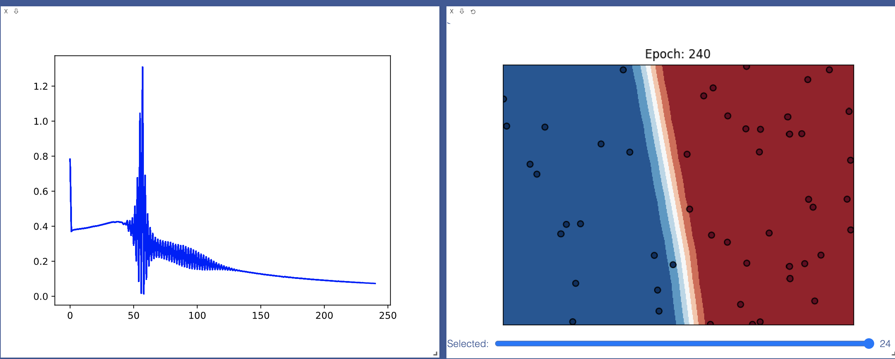
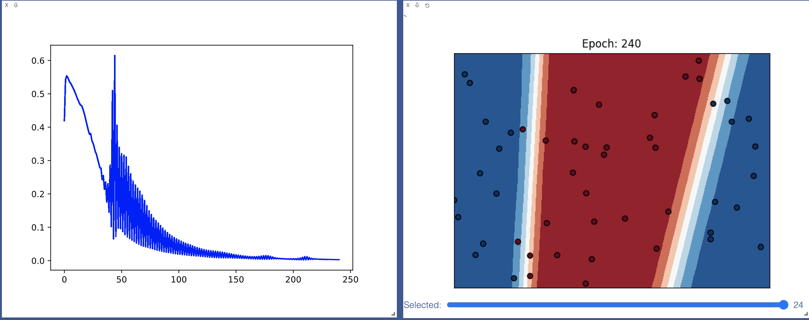
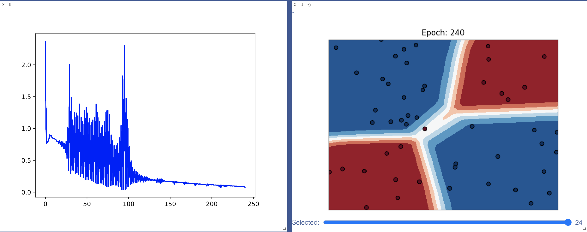

[](https://classroom.github.com/online_ide?assignment_repo_id=3590618&assignment_repo_type=AssignmentRepo)
# MiniTorch Module 3


* Docs: https://minitorch.github.io/

* Overview: https://minitorch.github.io/module3.html

This module requires `scalar.py`, `tensor_functions.py`, `tensor_data.py`, `tensor_ops.py`, `operators.py`, `module.py`, and `autodiff.py` from Module 2.

You will need to modify `tensor_functions.py` slightly in this assignment.

* Tests:

```
python run_tests.py
```

* Note:

Several of the tests for this assignment will only run if you are on a GPU machine and will not
run on github's test infrastructure. Please follow the instructions to setup up a colab machine
to run these tests.

## Simple

Epoch  0  loss  0.7821006988575873 correct 17 time 10.957945108413696
Epoch  10  loss  0.38673770443791927 correct 33 time 0.019263029098510742
Epoch  20  loss  0.4004290234488647 correct 33 time 0.019077777862548828
Epoch  30  loss  0.41807669958079435 correct 33 time 0.01892399787902832
Epoch  40  loss  0.4229036219870698 correct 42 time 0.01904010772705078
Epoch  50  loss  0.2925705751387985 correct 44 time 0.01949310302734375
Epoch  60  loss  0.09745349454424831 correct 44 time 0.018999099731445312
Epoch  70  loss  0.22312677301433778 correct 50 time 0.020002126693725586
Epoch  80  loss  0.19834941416042057 correct 50 time 0.021428823471069336
Epoch  90  loss  0.1691282187972923 correct 50 time 0.020443201065063477
Epoch  100  loss  0.15483858160946834 correct 50 time 0.01897907257080078
Epoch  110  loss  0.1522217977318557 correct 50 time 0.018672943115234375
Epoch  120  loss  0.1527375381040923 correct 50 time 0.01861095428466797
Epoch  130  loss  0.14636110265549182 correct 50 time 0.018619060516357422
Epoch  140  loss  0.13773790014297135 correct 50 time 0.0186917781829834
Epoch  150  loss  0.1272673508787969 correct 50 time 0.022942066192626953
Epoch  160  loss  0.11810439387997679 correct 50 time 0.018679141998291016
Epoch  170  loss  0.1094649382432915 correct 50 time 0.01854395866394043
Epoch  180  loss  0.10309187747925452 correct 50 time 0.018922090530395508
Epoch  190  loss  0.09637434408343296 correct 50 time 0.018707990646362305
Epoch  200  loss  0.09097085627809198 correct 50 time 0.01883101463317871
Epoch  210  loss  0.0848415703089092 correct 50 time 0.01878499984741211
Epoch  220  loss  0.08120226519982729 correct 50 time 0.0188901424407959
Epoch  230  loss  0.07738911952997968 correct 50 time 0.02446603775024414
Epoch  240  loss  0.07305968382451264 correct 50 time 0.01900506019592285

## Split

Epoch  0  loss  0.41940161439157875 correct 27 time 10.872546911239624
Epoch  10  loss  0.49871111571602356 correct 38 time 0.01932382583618164
Epoch  20  loss  0.40332905268382285 correct 41 time 0.01855182647705078
Epoch  30  loss  0.2922768305979222 correct 48 time 0.018666982650756836
Epoch  40  loss  0.2865147921460379 correct 44 time 0.018620014190673828
Epoch  50  loss  0.3207405904311064 correct 42 time 0.018787145614624023
Epoch  60  loss  0.2382432092099823 correct 43 time 0.019019603729248047
Epoch  70  loss  0.1802465096063754 correct 43 time 0.01948380470275879
Epoch  80  loss  0.12001895704342823 correct 44 time 0.01875591278076172
Epoch  90  loss  0.08418079769611211 correct 44 time 0.01960301399230957
Epoch  100  loss  0.06153482904583178 correct 43 time 0.01881098747253418
Epoch  110  loss  0.04668826617493065 correct 43 time 0.01917719841003418
Epoch  120  loss  0.03487540693592397 correct 44 time 0.018558979034423828
Epoch  130  loss  0.02877325779070097 correct 45 time 0.021378040313720703
Epoch  140  loss  0.02389702325935946 correct 44 time 0.018791913986206055
Epoch  150  loss  0.017458710970267754 correct 44 time 0.01897597312927246
Epoch  160  loss  0.01284887536825914 correct 45 time 0.018824100494384766
Epoch  170  loss  0.012755764859349018 correct 44 time 0.01872396469116211
Epoch  180  loss  0.013023179161804326 correct 44 time 0.019462108612060547
Epoch  190  loss  0.006288390831467674 correct 48 time 0.01879596710205078
Epoch  200  loss  0.005604712685571304 correct 45 time 0.018942832946777344
Epoch  210  loss  0.0120462605683726 correct 43 time 0.023440837860107422
Epoch  220  loss  0.004992438078258447 correct 49 time 0.01909017562866211
Epoch  230  loss  0.003217935913967606 correct 48 time 0.018646717071533203
Epoch  240  loss  0.0027666172021656773 correct 48 time 0.01973891258239746

## XOR

Epoch  0  loss  2.3707006237456385 correct 33 time 9.974817991256714
Epoch  10  loss  0.8435781182661737 correct 37 time 0.01963973045349121
Epoch  20  loss  0.717279152661007 correct 40 time 0.018896102905273438
Epoch  30  loss  0.2904045133250702 correct 44 time 0.018618106842041016
Epoch  40  loss  0.27273707511443984 correct 44 time 0.019257068634033203
Epoch  50  loss  0.20410114642684898 correct 45 time 0.0187530517578125
Epoch  60  loss  0.1461859725821339 correct 45 time 0.01875615119934082
Epoch  70  loss  0.12367285872186583 correct 45 time 0.018628835678100586
Epoch  80  loss  0.11126066966691793 correct 47 time 0.01963067054748535
Epoch  90  loss  0.08410652836418273 correct 47 time 0.019370079040527344
Epoch  100  loss  0.09210363071872946 correct 49 time 0.01912403106689453
Epoch  110  loss  0.15369616051540202 correct 49 time 0.01884007453918457
Epoch  120  loss  0.17270431677180392 correct 49 time 0.01880812644958496
Epoch  130  loss  0.18220555165322425 correct 49 time 0.019090890884399414
Epoch  140  loss  0.15513975003588723 correct 49 time 0.01895308494567871
Epoch  150  loss  0.165012721372204 correct 49 time 0.018810033798217773
Epoch  160  loss  0.1566794853241428 correct 49 time 0.02088785171508789
Epoch  170  loss  0.1493901968768197 correct 49 time 0.018642902374267578
Epoch  180  loss  0.10622099099674275 correct 50 time 0.01887369155883789
Epoch  190  loss  0.12447430785497296 correct 50 time 0.019000768661499023
Epoch  200  loss  0.11433332945245595 correct 50 time 0.02122187614440918
Epoch  210  loss  0.11434651303683381 correct 50 time 0.018779754638671875
Epoch  220  loss  0.1044785937921754 correct 50 time 0.01908087730407715
Epoch  230  loss  0.09487152202329398 correct 50 time 0.02135300636291504
Epoch  240  loss  0.07388040807456933 correct 50 time 0.01977682113647461

## 3.5 bigger model cpu
Epoch  0  loss  7.097922654604099 correct 32 time 10.476984739303589
Epoch  10  loss  13.813785145406744 correct 32 time 0.09907388687133789
Epoch  20  loss  13.81261162633052 correct 32 time 0.0960392951965332
Epoch  30  loss  13.808420779796117 correct 32 time 0.10110878944396973
Epoch  40  loss  13.37055451239291 correct 32 time 0.09660530090332031
Epoch  50  loss  0.00036819113279674433 correct 37 time 0.09807801246643066
Epoch  60  loss  4.254004664223407e-05 correct 24 time 0.09635519981384277
Epoch  70  loss  3.508240801044043 correct 33 time 0.09657979011535645
Epoch  80  loss  0.511802975052869 correct 37 time 0.09525823593139648
Epoch  90  loss  1.4450314152256198 correct 35 time 0.09556198120117188
Epoch  100  loss  0.19428223100396536 correct 46 time 0.09504389762878418
Epoch  110  loss  0.09092111201730362 correct 50 time 0.10109996795654297
Epoch  120  loss  0.10279565537117946 correct 50 time 0.09772992134094238
Epoch  130  loss  0.11171481831714361 correct 50 time 0.10806417465209961
Epoch  140  loss  0.11184755825140395 correct 50 time 0.09891819953918457
Epoch  150  loss  0.10821188117595724 correct 50 time 0.09552407264709473
Epoch  160  loss  0.10597655077578334 correct 50 time 0.09571576118469238
Epoch  170  loss  0.10612338401068672 correct 50 time 0.09541893005371094
Epoch  180  loss  0.10558203891893811 correct 50 time 0.09859299659729004
Epoch  190  loss  0.10354667050047496 correct 50 time 0.09794282913208008
Epoch  200  loss  0.10108315383672961 correct 50 time 0.10743188858032227
Epoch  210  loss  0.09993800497836547 correct 50 time 0.10378217697143555
Epoch  220  loss  0.09774230518739119 correct 50 time 0.10219407081604004
Epoch  230  loss  0.0960056354192996 correct 50 time 0.10912609100341797
Epoch  240  loss  0.09379962540050031 correct 50 time 0.09613800048828125

## 3.5 bigger model gpu
Epoch  0  loss  -9.818539257590367e-07 correct 30 time 3.0368311405181885
Epoch  10  loss  0.780028247651 correct 32 time 0.3687770366668701
Epoch  20  loss  0.001373706784786907 correct 43 time 0.36572885513305664
Epoch  30  loss  0.012438635617473343 correct 41 time 0.4262423515319824
Epoch  40  loss  2.241522649598066 correct 29 time 0.3895699977874756
Epoch  50  loss  2.9642348387255573e-05 correct 42 time 0.3668789863586426
Epoch  60  loss  0.3014506543783058 correct 48 time 0.361666202545166
Epoch  70  loss  1.183685773250028 correct 43 time 0.37239885330200195
Epoch  80  loss  0.9825928621404603 correct 44 time 0.38912439346313477
Epoch  90  loss  0.9710887156013461 correct 44 time 0.3599705696105957
Epoch  100  loss  0.8304672094071535 correct 45 time 0.3777651786804199
Epoch  110  loss  0.5806530545113252 correct 47 time 0.38132476806640625
Epoch  120  loss  0.3984208366649121 correct 48 time 0.3649415969848633
Epoch  130  loss  0.2994420915250122 correct 49 time 0.3631937503814697
Epoch  140  loss  0.24697447040963177 correct 50 time 0.36818480491638184
Epoch  150  loss  0.21049702202433426 correct 50 time 0.35959410667419434
Epoch  160  loss  0.18557421997732934 correct 50 time 0.36485934257507324
Epoch  170  loss  0.168117146246112 correct 50 time 0.3648874759674072
Epoch  180  loss  0.1576512211546602 correct 50 time 0.3671603202819824
Epoch  190  loss  0.15090566393941887 correct 50 time 0.3625457286834717
Epoch  200  loss  0.14711240965621297 correct 50 time 0.36255693435668945
Epoch  210  loss  0.14415709068032065 correct 50 time 0.3725728988647461
Epoch  220  loss  0.14107270674927125 correct 50 time 0.3870406150817871
Epoch  230  loss  0.1396047098211652 correct 50 time 0.3785536289215088
Epoch  240  loss  0.13684591182734782 correct 50 time 0.3689913749694824

## 3.1 parallel test
MAP
 
================================================================================
 Parallel Accelerator Optimizing:  Function tensor_map.<locals>._map, 
/Users/vaynetian/Projects/MiniTorch/minitorch-3-Dearkano/minitorch/fast_ops.py 
(41)  
================================================================================


Parallel loop listing for  Function tensor_map.<locals>._map, /Users/vaynetian/Projects/MiniTorch/minitorch-3-Dearkano/minitorch/fast_ops.py (41) 
--------------------------------------------------------------------------------|loop #ID
    def _map(out, out_shape, out_strides, in_storage, in_shape, in_strides):    | 
        # TODO: Implement for Task 2.2.                                         | 
                                                                                | 
        for i in prange(len(out)):----------------------------------------------| #2
            out_index = np.zeros(MAX_DIMS, np.int32)----------------------------| #0
            in_index = np.zeros(MAX_DIMS, np.int32)-----------------------------| #1
            count(i, out_shape, out_index)                                      | 
            broadcast_index(out_index, out_shape, in_shape, in_index)           | 
            data = in_storage[index_to_position(in_index, in_strides)]          | 
            map_data = fn(data)                                                 | 
            out[index_to_position(out_index, out_strides)] = map_data           | 
--------------------------------- Fusing loops ---------------------------------
Attempting fusion of parallel loops (combines loops with similar properties)...
Following the attempted fusion of parallel for-loops there are 3 parallel for-
loop(s) (originating from loops labelled: #2, #0, #1).
--------------------------------------------------------------------------------
---------------------------- Optimising loop nests -----------------------------
Attempting loop nest rewrites (optimising for the largest parallel loops)...
 
+--2 is a parallel loop
   +--0 --> rewritten as a serial loop
   +--1 --> rewritten as a serial loop
--------------------------------------------------------------------------------
----------------------------- Before Optimisation ------------------------------
Parallel region 0:
+--2 (parallel)
   +--0 (parallel)
   +--1 (parallel)


--------------------------------------------------------------------------------
------------------------------ After Optimisation ------------------------------
Parallel region 0:
+--2 (parallel)
   +--0 (serial)
   +--1 (serial)


 
Parallel region 0 (loop #2) had 0 loop(s) fused and 2 loop(s) serialized as part
 of the larger parallel loop (#2).
--------------------------------------------------------------------------------
--------------------------------------------------------------------------------
 
---------------------------Loop invariant code motion---------------------------
Allocation hoisting:
The memory allocation derived from the instruction at 
/Users/vaynetian/Projects/MiniTorch/minitorch-3-Dearkano/minitorch/fast_ops.py 
(45) is hoisted out of the parallel loop labelled #2 (it will be performed 
before the loop is executed and reused inside the loop):
   Allocation:: out_index = np.zeros(MAX_DIMS, np.int32)
    - numpy.empty() is used for the allocation.
The memory allocation derived from the instruction at 
/Users/vaynetian/Projects/MiniTorch/minitorch-3-Dearkano/minitorch/fast_ops.py 
(46) is hoisted out of the parallel loop labelled #2 (it will be performed 
before the loop is executed and reused inside the loop):
   Allocation:: in_index = np.zeros(MAX_DIMS, np.int32)
    - numpy.empty() is used for the allocation.
None
ZIP
 
================================================================================
 Parallel Accelerator Optimizing:  Function tensor_zip.<locals>._zip, 
/Users/vaynetian/Projects/MiniTorch/minitorch-3-Dearkano/minitorch/fast_ops.py 
(109)  
================================================================================


Parallel loop listing for  Function tensor_zip.<locals>._zip, /Users/vaynetian/Projects/MiniTorch/minitorch-3-Dearkano/minitorch/fast_ops.py (109) 
-------------------------------------------------------------------------|loop #ID
    def _zip(                                                            | 
        out,                                                             | 
        out_shape,                                                       | 
        out_strides,                                                     | 
        a_storage,                                                       | 
        a_shape,                                                         | 
        a_strides,                                                       | 
        b_storage,                                                       | 
        b_shape,                                                         | 
        b_strides,                                                       | 
    ):                                                                   | 
        for i in prange(len(out)):---------------------------------------| #6
            a_index = np.zeros(MAX_DIMS, np.int32)-----------------------| #3
            b_index = np.zeros(MAX_DIMS, np.int32)-----------------------| #4
            o_index = np.zeros(MAX_DIMS, np.int32)-----------------------| #5
            count(i, out_shape, o_index)                                 | 
            broadcast_index(o_index, out_shape, a_shape, a_index)        | 
            broadcast_index(o_index, out_shape, b_shape, b_index)        | 
            a_data = a_storage[index_to_position(a_index, a_strides)]    | 
            b_data = b_storage[index_to_position(b_index, b_strides)]    | 
            map_data = fn(a_data, b_data)                                | 
            out[index_to_position(o_index, out_strides)] = map_data      | 
--------------------------------- Fusing loops ---------------------------------
Attempting fusion of parallel loops (combines loops with similar properties)...
Following the attempted fusion of parallel for-loops there are 4 parallel for-
loop(s) (originating from loops labelled: #6, #3, #4, #5).
--------------------------------------------------------------------------------
---------------------------- Optimising loop nests -----------------------------
Attempting loop nest rewrites (optimising for the largest parallel loops)...
 
+--6 is a parallel loop
   +--3 --> rewritten as a serial loop
   +--4 --> rewritten as a serial loop
   +--5 --> rewritten as a serial loop
--------------------------------------------------------------------------------
----------------------------- Before Optimisation ------------------------------
Parallel region 0:
+--6 (parallel)
   +--3 (parallel)
   +--4 (parallel)
   +--5 (parallel)


--------------------------------------------------------------------------------
------------------------------ After Optimisation ------------------------------
Parallel region 0:
+--6 (parallel)
   +--3 (serial)
   +--4 (serial)
   +--5 (serial)


 
Parallel region 0 (loop #6) had 0 loop(s) fused and 3 loop(s) serialized as part
 of the larger parallel loop (#6).
--------------------------------------------------------------------------------
--------------------------------------------------------------------------------
 
---------------------------Loop invariant code motion---------------------------
Allocation hoisting:
The memory allocation derived from the instruction at 
/Users/vaynetian/Projects/MiniTorch/minitorch-3-Dearkano/minitorch/fast_ops.py 
(121) is hoisted out of the parallel loop labelled #6 (it will be performed 
before the loop is executed and reused inside the loop):
   Allocation:: a_index = np.zeros(MAX_DIMS, np.int32)
    - numpy.empty() is used for the allocation.
The memory allocation derived from the instruction at 
/Users/vaynetian/Projects/MiniTorch/minitorch-3-Dearkano/minitorch/fast_ops.py 
(122) is hoisted out of the parallel loop labelled #6 (it will be performed 
before the loop is executed and reused inside the loop):
   Allocation:: b_index = np.zeros(MAX_DIMS, np.int32)
    - numpy.empty() is used for the allocation.
The memory allocation derived from the instruction at 
/Users/vaynetian/Projects/MiniTorch/minitorch-3-Dearkano/minitorch/fast_ops.py 
(123) is hoisted out of the parallel loop labelled #6 (it will be performed 
before the loop is executed and reused inside the loop):
   Allocation:: o_index = np.zeros(MAX_DIMS, np.int32)
    - numpy.empty() is used for the allocation.
None
REDUCE
 
================================================================================
 Parallel Accelerator Optimizing:  Function tensor_reduce.<locals>._reduce, 
/Users/vaynetian/Projects/MiniTorch/minitorch-3-Dearkano/minitorch/fast_ops.py 
(181)  
================================================================================


Parallel loop listing for  Function tensor_reduce.<locals>._reduce, /Users/vaynetian/Projects/MiniTorch/minitorch-3-Dearkano/minitorch/fast_ops.py (181) 
---------------------------------------------------------------------------------|loop #ID
    def _reduce(                                                                 | 
        out,                                                                     | 
        out_shape,                                                               | 
        out_strides,                                                             | 
        a_storage,                                                               | 
        a_shape,                                                                 | 
        a_strides,                                                               | 
        reduce_shape,                                                            | 
        reduce_size,                                                             | 
    ):                                                                           | 
        for p in prange(len(out)):-----------------------------------------------| #11
            index = np.zeros(MAX_DIMS, np.int32)---------------------------------| #7
            offset = np.zeros(MAX_DIMS, np.int32)--------------------------------| #8
            count(p, out_shape, index)                                           | 
            k = index_to_position(index, out_strides)                            | 
            for s in prange(reduce_size):----------------------------------------| #10
                count(s, reduce_shape, offset)                                   | 
                a_index = index + offset-----------------------------------------| #9
                out[k] = fn(                                                     | 
                    out[k], a_storage[index_to_position(a_index, a_strides)])    | 
--------------------------------- Fusing loops ---------------------------------
Attempting fusion of parallel loops (combines loops with similar properties)...
Following the attempted fusion of parallel for-loops there are 4 parallel for-
loop(s) (originating from loops labelled: #11, #7, #8, #10).
--------------------------------------------------------------------------------
---------------------------- Optimising loop nests -----------------------------
Attempting loop nest rewrites (optimising for the largest parallel loops)...
 
+--11 is a parallel loop
   +--8 --> rewritten as a serial loop
   +--10 --> rewritten as a serial loop
      +--9 --> rewritten as a serial loop
   +--7 --> rewritten as a serial loop
--------------------------------------------------------------------------------
----------------------------- Before Optimisation ------------------------------
Parallel region 0:
+--11 (parallel)
   +--8 (parallel)
   +--10 (parallel)
      +--9 (parallel)
   +--7 (parallel)


--------------------------------------------------------------------------------
------------------------------ After Optimisation ------------------------------
Parallel region 0:
+--11 (parallel)
   +--8 (serial)
   +--10 (serial)
      +--9 (serial)
   +--7 (serial)


 
Parallel region 0 (loop #11) had 0 loop(s) fused and 4 loop(s) serialized as 
part of the larger parallel loop (#11).
--------------------------------------------------------------------------------
--------------------------------------------------------------------------------
 
---------------------------Loop invariant code motion---------------------------
Allocation hoisting:
The memory allocation derived from the instruction at 
/Users/vaynetian/Projects/MiniTorch/minitorch-3-Dearkano/minitorch/fast_ops.py 
(192) is hoisted out of the parallel loop labelled #11 (it will be performed 
before the loop is executed and reused inside the loop):
   Allocation:: index = np.zeros(MAX_DIMS, np.int32)
    - numpy.empty() is used for the allocation.
The memory allocation derived from the instruction at 
/Users/vaynetian/Projects/MiniTorch/minitorch-3-Dearkano/minitorch/fast_ops.py 
(193) is hoisted out of the parallel loop labelled #11 (it will be performed 
before the loop is executed and reused inside the loop):
   Allocation:: offset = np.zeros(MAX_DIMS, np.int32)
    - numpy.empty() is used for the allocation.
None
MATRIX MULTIPLY
 
================================================================================
 Parallel Accelerator Optimizing:  Function tensor_matrix_multiply, 
/Users/vaynetian/Projects/MiniTorch/minitorch-3-Dearkano/minitorch/fast_ops.py 
(262)  
================================================================================


Parallel loop listing for  Function tensor_matrix_multiply, /Users/vaynetian/Projects/MiniTorch/minitorch-3-Dearkano/minitorch/fast_ops.py (262) 
----------------------------------------------------------------------|loop #ID
@njit(parallel=True)                                                  | 
def tensor_matrix_multiply(                                           | 
    out,                                                              | 
    out_shape,                                                        | 
    out_strides,                                                      | 
    a_storage,                                                        | 
    a_shape,                                                          | 
    a_strides,                                                        | 
    b_storage,                                                        | 
    b_shape,                                                          | 
    b_strides,                                                        | 
):                                                                    | 
    """                                                               | 
    NUMBA tensor matrix multiply function.                            | 
                                                                      | 
    Should work for any tensor shapes that broadcast as long as ::    | 
                                                                      | 
        assert a_shape[-1] == b_shape[-2]                             | 
                                                                      | 
    Args:                                                             | 
        out (array): storage for `out` tensor                         | 
        out_shape (array): shape for `out` tensor                     | 
        out_strides (array): strides for `out` tensor                 | 
        a_storage (array): storage for `a` tensor                     | 
        a_shape (array): shape for `a` tensor                         | 
        a_strides (array): strides for `a` tensor                     | 
        b_storage (array): storage for `b` tensor                     | 
        b_shape (array): shape for `b` tensor                         | 
        b_strides (array): strides for `b` tensor                     | 
                                                                      | 
    Returns:                                                          | 
        None : Fills in `out`                                         | 
    """                                                               | 
    for p in prange(len(out)):----------------------------------------| #15
        out_index = np.zeros(len(out_shape), np.int32)----------------| #12
        count(p, out_shape, out_index)                                | 
        pos = index_to_position(out_index, out_strides)               | 
                                                                      | 
        a_index = np.zeros(len(a_shape), np.int32)--------------------| #13
        broadcast_index(out_index, out_shape, a_shape, a_index)       | 
        a_index[-2] = out_index[-2]                                   | 
                                                                      | 
        b_index = np.zeros(len(b_shape), np.int32)--------------------| #14
        broadcast_index(out_index, out_shape, b_shape, b_index)       | 
        b_index[-1] = out_index[-1]                                   | 
                                                                      | 
        for k in range(a_shape[-1]):                                  | 
            a_index[-1] = k                                           | 
            a_start = index_to_position(a_index, a_strides)           | 
            b_index[-2] = k                                           | 
            b_start = index_to_position(b_index, b_strides)           | 
            out[pos] += a_storage[a_start] * b_storage[b_start]       | 
--------------------------------- Fusing loops ---------------------------------
Attempting fusion of parallel loops (combines loops with similar properties)...
Following the attempted fusion of parallel for-loops there are 4 parallel for-
loop(s) (originating from loops labelled: #15, #14, #12, #13).
--------------------------------------------------------------------------------
---------------------------- Optimising loop nests -----------------------------
Attempting loop nest rewrites (optimising for the largest parallel loops)...
 
+--15 is a parallel loop
   +--12 --> rewritten as a serial loop
   +--13 --> rewritten as a serial loop
   +--14 --> rewritten as a serial loop
--------------------------------------------------------------------------------
----------------------------- Before Optimisation ------------------------------
Parallel region 0:
+--15 (parallel)
   +--12 (parallel)
   +--13 (parallel)
   +--14 (parallel)


--------------------------------------------------------------------------------
------------------------------ After Optimisation ------------------------------
Parallel region 0:
+--15 (parallel)
   +--12 (serial)
   +--13 (serial)
   +--14 (serial)


 
Parallel region 0 (loop #15) had 0 loop(s) fused and 3 loop(s) serialized as 
part of the larger parallel loop (#15).
--------------------------------------------------------------------------------
--------------------------------------------------------------------------------
 
---------------------------Loop invariant code motion---------------------------
Allocation hoisting:
The memory allocation derived from the instruction at 
/Users/vaynetian/Projects/MiniTorch/minitorch-3-Dearkano/minitorch/fast_ops.py 
(304) is hoisted out of the parallel loop labelled #15 (it will be performed 
before the loop is executed and reused inside the loop):
   Allocation:: b_index = np.zeros(len(b_shape), np.int32)
    - numpy.empty() is used for the allocation.
The memory allocation derived from the instruction at 
/Users/vaynetian/Projects/MiniTorch/minitorch-3-Dearkano/minitorch/fast_ops.py 
(296) is hoisted out of the parallel loop labelled #15 (it will be performed 
before the loop is executed and reused inside the loop):
   Allocation:: out_index = np.zeros(len(out_shape), np.int32)
    - numpy.empty() is used for the allocation.
The memory allocation derived from the instruction at 
/Users/vaynetian/Projects/MiniTorch/minitorch-3-Dearkano/minitorch/fast_ops.py 
(300) is hoisted out of the parallel loop labelled #15 (it will be performed 
before the loop is executed and reused inside the loop):
   Allocation:: a_index = np.zeros(len(a_shape), np.int32)
    - numpy.empty() is used for the allocation.
None