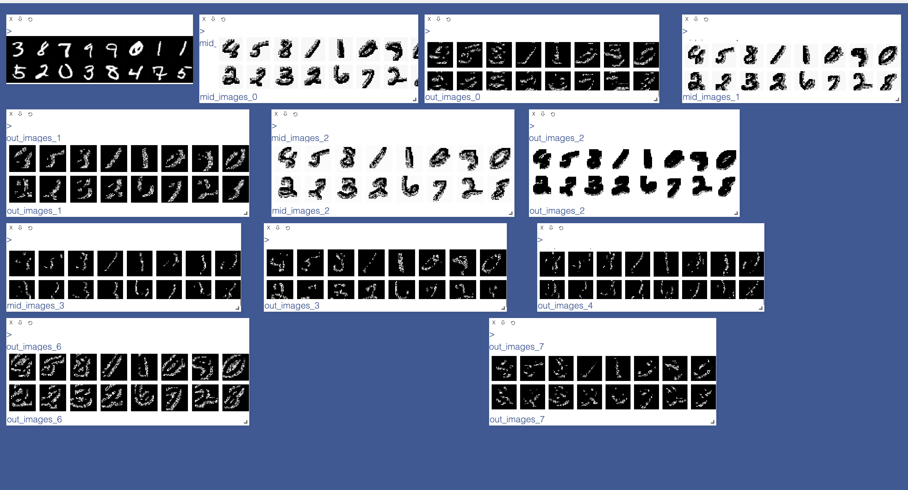

[](https://classroom.github.com/online_ide?assignment_repo_id=3714428&assignment_repo_type=AssignmentRepo)
# MiniTorch Module 4


* Docs: https://minitorch.github.io/

* Overview: https://minitorch.github.io/module4.html

This module requires `fast_ops.py`, `cuda_ops.py`, `scalar.py`, `tensor_functions.py`, `tensor_data.py`, `tensor_ops.py`, `operators.py`, `module.py`, and `autodiff.py` from Module 3.


Additionally you will need to install and download the MNist library.

(On Mac, this may require installing the `wget` command)

```
pip install python-mnist
mnist_get_data.sh
```


* Tests:

```
python run_tests.py
```

Epoch  0  example  0  loss  36.672401308875735  accuracy  0.1

Epoch  0  example  800  loss  1839.2668320366386  accuracy  0.2

Epoch  0  example  1600  loss  1827.8876786483518  accuracy  0.275

Epoch  0  example  2400  loss  1729.328364022529  accuracy  0.425

Epoch  0  example  3200  loss  1240.0646340643113  accuracy  0.675

Epoch  0  example  4000  loss  1007.1268099614645  accuracy  0.625

Epoch  0  example  4800  loss  825.6674518357189  accuracy  0.75

Epoch  1  example  0  loss  15.635053561626822  accuracy  0.725

Epoch  1  example  800  loss  907.5759004925283  accuracy  0.7375

Epoch  1  example  1600  loss  943.5870538625069  accuracy  0.625

Epoch  1  example  2400  loss  760.4841068923073  accuracy  0.725

Epoch  1  example  3200  loss  719.6048578589795  accuracy  0.7625

Epoch  1  example  4000  loss  569.7756905782312  accuracy  0.7625

Epoch  1  example  4800  loss  546.2592655224673  accuracy  0.7875

Epoch  2  example  0  loss  4.917468218179653  accuracy  0.7625

Epoch  2  example  800  loss  442.7029807278163  accuracy  0.8125

Epoch  2  example  1600  loss  496.910955161138  accuracy  0.7875

Epoch  2  example  2400  loss  341.8138546252697  accuracy  0.8125

Epoch  2  example  3200  loss  350.0314401553584  accuracy  0.8375

Epoch  2  example  4000  loss  339.8376089673806  accuracy  0.875

Epoch  2  example  4800  loss  341.11291754829176  accuracy  0.875

Epoch  3  example  0  loss  4.262272532423595  accuracy  0.8375

Epoch  3  example  800  loss  284.8566602557847  accuracy  0.8625

Epoch  3  example  1600  loss  392.4846903921442  accuracy  0.8625

Epoch  3  example  2400  loss  241.86357622505935  
accuracy  0.8125

Epoch  3  example  3200  loss  269.0349400103331  accuracy  0.875

Epoch  3  example  4000  loss  228.99854209762555  accuracy  0.8625

Epoch  3  example  4800  loss  239.2206572718328  accuracy  0.85

Epoch  4  example  0  loss  1.5841074584755201  accuracy  0.85

Epoch  4  example  800  loss  261.5370121262461  accuracy  0.875

Epoch  4  example  1600  loss  335.4852186176354  accuracy  0.8125

Epoch  4  example  2400  loss  193.65097349627686  accuracy  0.925

Epoch  4  example  3200  loss  256.75422427153467  accuracy  0.925

Epoch  4  example  4000  loss  251.09228252072128  accuracy  0.8875

Epoch  4  example  4800  loss  229.87232113198377  accuracy  0.875

Epoch  5  example  0  loss  1.635937872116878  accuracy  0.8625

Epoch  5  example  800  loss  205.65436481262935  accuracy  0.8875

Epoch  5  example  1600  loss  275.14782494086035  accuracy  0.8375

Epoch  5  example  2400  loss  204.73902991708678  accuracy  0.8375

Epoch  5  example  3200  loss  246.3959448244543  accuracy  0.9

Epoch  5  example  4000  loss  208.67620911601105  accuracy  0.85

Epoch  5  example  4800  loss  212.05609624919276  accuracy  0.875

Epoch  6  example  0  loss  1.0024704528965938  accuracy  0.925

Epoch  6  example  800  loss  192.24964561700278  accuracy  0.8875

Epoch  6  example  1600  loss  245.98519568818156  accuracy  0.8375

Epoch  6  example  2400  loss  145.6502310619584  accuracy  0.8875

Epoch  6  example  3200  loss  223.66464446734628  accuracy  0.875

Epoch  6  example  4000  loss  166.58144163022743  accuracy  0.8875

Epoch  6  example  4800  loss  190.27278140202387  accuracy  0.8875

Epoch  7  example  0  loss  1.1605665400759695  accuracy  0.8875

Epoch  7  example  800  loss  191.4858261816284  accuracy  0.8875

Epoch  7  example  1600  loss  240.41157505328374  accuracy  0.8375

Epoch  7  example  2400  loss  157.51503092661787  accuracy  0.875

Epoch  7  example  3200  loss  206.8250151848191  accuracy  0.8875

Epoch  7  example  4000  loss  176.61667847043614  accuracy  0.875

Epoch  7  example  4800  loss  157.13096345578475  accuracy  0.8625

Epoch  8  example  0  loss  0.7486209317772783  accuracy  0.9

Epoch  8  example  800  loss  168.1189592142579  accuracy  0.9

Epoch  8  example  1600  loss  242.68882723046482  accuracy  0.9

Epoch  8  example  2400  loss  161.75244381755667  accuracy  0.8875

Epoch  8  example  3200  loss  201.3981042585615  accuracy  0.9

Epoch  8  example  4000  loss  185.44347395996098  accuracy  0.875

Epoch  8  example  4800  loss  199.35885693834584  accuracy  0.8875

Epoch  9  example  0  loss  0.2517145032933854  accuracy  0.925

Epoch  9  example  800  loss  161.79366623717004  accuracy  0.8875

Epoch  9  example  1600  loss  172.97235377327578  accuracy  0.9

Epoch  9  example  2400  loss  126.33270504959788  accuracy  0.825

Epoch  9  example  3200  loss  155.6295301169301  accuracy  0.875

Epoch  9  example  4000  loss  171.39172555940993  accuracy  0.875

Epoch  9  example  4800  loss  146.9597962009756  accuracy  0.875

Epoch  10  example  0  loss  2.2292632934169285  accuracy  0.925

Epoch  10  example  800  loss  136.65436745860063  accuracy  0.9

Epoch  10  example  1600  loss  169.8032798152685  accuracy  0.925

Epoch  10  example  2400  loss  122.6362819189669  accuracy  0.9125

Epoch  10  example  3200  loss  134.78281892563368  accuracy  0.8875

Epoch  10  example  4000  loss  139.4067583990464  accuracy  0.9125

Epoch  10  example  4800  loss  164.49170032929203  accuracy  0.8875

Epoch  11  example  0  loss  2.328213742213551  accuracy  0.9375

Epoch  11  example  800  loss  177.63179336120785  accuracy  0.975